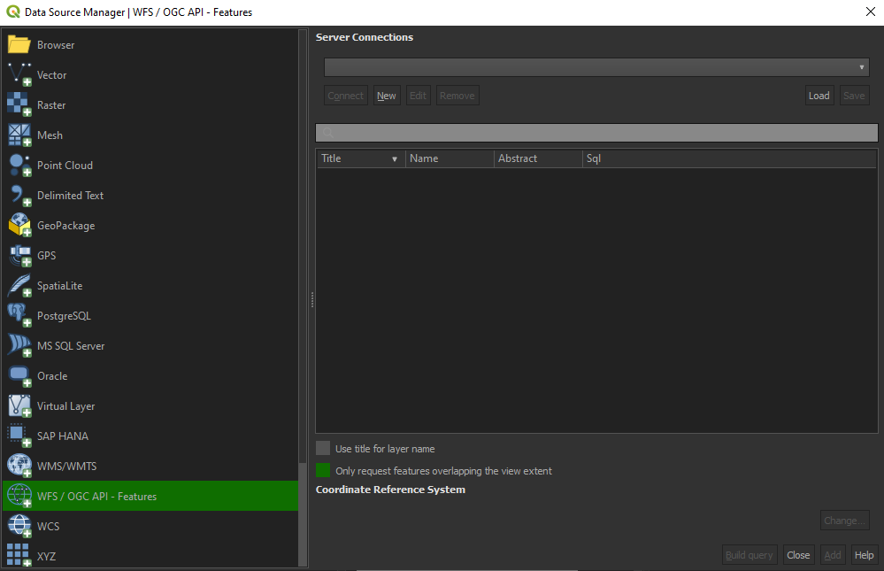

## Client access

### QGIS

QGIS is one of the first GIS Desktop clients which added support for [OGC API - Features](https://www.qgis.org/en/site/forusers/visualchangelog312/index.html#feature-ogc-api-features-provider). Support has been integrated into the existing WFS provider.

#### Open an OGC API - Features collection in QGIS

Follow the steps to add some collections from an OGC API - Features enpoint: 

* From the Layer menu, select `Add Layer` > `Add WFS layer`
* From the `Data source manager` panel, choose 'New connection'

*Connexion to an OGC API Features service via QGIS*

* Add the URL [https://ogc.heig-vd.ch/pygeoapi](https://ogc.heig-vd.ch/pygeoapi) (or the address of a local server)
* You can now click the `detect` button and QGIS will notice you are configuring an OGC API - Features endpoint
* QGIS facilitates to set page size (request is split in multiple requests)
    - for **points** you can easily set it to **2500**
    - for some **polygons** with **high density**, **100** can already be slow
* Press `OK` to save the connection and return to the previous screen
* Now click the `Connect` button to retireve the collections of the service

*List of collections of an OGC API Features service in QGIS*

* You can now add collections to your QGIS project
* You can also build a query to add a subset of the collection
* Close the `Data source manager`. Notice that QGIS applied a default styling just like it would if you add a file based layer. You can work with the collection in a similar way; identify, apply styling, filter, export, etc.

> **_NOTE:_**

Although the above procedure has been explained for **pygeoapi**, the other services are also accessible via the following urls:

| Service | URL | 
| --- | --- |
|pygeoapi|[https://ogc.heig-vd.ch/pygeoapi](https://ogc.heig-vd.ch/pygeoapi)
|ldproxy|[https://ogc.heig-vd.ch/ldproxy/geoclimate](https://ogc.heig-vd.ch/ldproxy/geoclimate)
|geoserver|[https://ogc.heig-vd.ch/geoserver/ogc/features](https://ogc.heig-vd.ch/geoserver/ogc/features)
|qgis-server|[https://ogc.heig-vd.ch/qgis/wfs3/collections/](https://ogc.heig-vd.ch/qgis/wfs3/collections/)

> **_TIP:_**

Install and activate the `QGIS Network Logger` extension. It will display HTTP traffice within QGIS and is a valuable tool in debugging failing connections.

**Reference**: [https://dive.pygeoapi.io/publish/ogcfeat/#client-access](https://dive.pygeoapi.io/publish/ogcfeat/#client-access)

### ArcGIS Pro 

ArcGIS Pro [supports OGC API - Features](https://pro.arcgis.com/en/pro-app/2.8/help/data/services/use-ogc-api-services.htm) since release 2.8.

#### Open an OGC API - Features collection in ArcGIS Pro

1. On the **Insert** tab, in the **Project** group, click the **Connections** drop-down list and click **New OGC API Server**.
 The **Add OGC API Server Connection** dialog box appears.

2. Enter the URL of the OGC API server site you want to connect to in the **Server URL** text box. The URL varies depending on the site configuration.

3. If the OGC API service you are connecting to has additional capabilities or requires a special key-value pair (for example, an api key), you can add custom request parameter names and values to the **Custom request parameters** section. Be aware that ArcGIS Pro cannot validate these additional parameters.

4. Type your user name and password if appropriate.

5. Click **OK**.
 An OGC API connection file (.ogc) is created and saved in the project's home folder. An item referencing this connection file is added to the project, and the connection appears in the **Servers** folder on the Project tab of the **Catalog** pane.

6. Expand the OGC API connection to view the layers present on the OGC API server. Right-click a layer and click either **Add to new map** or Add to current map to add a layer to the map. You can also add the service to the map by dragging it onto the map or into the **Contents** pane. 

**Reference**: [https://pro.arcgis.com/en/pro-app/2.8/help/data/services/add-ogc-api-services.htm](https://pro.arcgis.com/en/pro-app/2.8/help/data/services/add-ogc-api-services.htm)