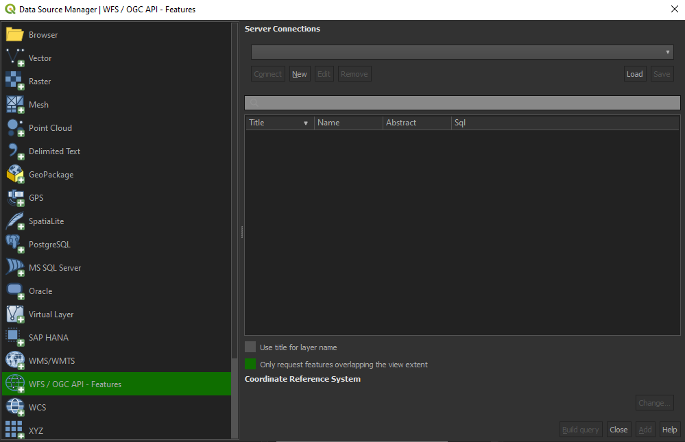

### QGIS

QGIS is one of the first GIS Desktop clients which added support for [OGC API - Features](https://www.qgis.org/en/site/forusers/visualchangelog312/index.html#feature-ogc-api-features-provider). Support has been integrated into the existing WFS provider.

#### Open an OGC API - Features collection in QGIS

Follow the steps to add some collections from an OGC API - Features enpoint: 

* From the Layer menu, select `Add Layer` > `Add WFS layer`
* From the `Data source manager` panel, choose 'New connection'


*Connexion to an OGC API Features service via QGIS*

* Add the URL [https://ogc.heig-vd.ch/pygeoapi](https://ogc.heig-vd.ch/pygeoapi) (or the address of a local server)
* You can now click the `detect` button and QGIS will notice you are configuring an OGC API - Features endpoint
* QGIS facilitates to set page size (request is split in multiple requests)
    - for **points** you can easily set it to **2500**
    - for some **polygons** with **high density**, **100** can already be slow
* Press `OK` to save the connection and return to the previous screen
* Now click the `Connect` button to retireve the collections of the service


*List of collections of an OGC API Features service in QGIS*

* You can now add collections to your QGIS project
* You can also build a query to add a subset of the collection
* Close the `Data source manager`. Notice that QGIS applied a default styling just like it would if you add a file based layer. You can work with the collection in a similar way; identify, apply styling, filter, export, etc.

!!! note

Although the above procedure has been explained for **pygeoapi**, the other services are also accessible via the following urls:

| Service | URL | 
| --- | --- |
|pygeoapi|[https://ogc.heig-vd.ch/pygeoapi](https://ogc.heig-vd.ch/pygeoapi)
|ldproxy|[https://ogc.heig-vd.ch/ldproxy/geoclimate](https://ogc.heig-vd.ch/ldproxy/geoclimate)
|geoserver|[https://ogc.heig-vd.ch/geoserver/ogc/features](https://ogc.heig-vd.ch/geoserver/ogc/features)
|qgis-server|[https://ogc.heig-vd.ch/qgis/wfs3/collections/](https://ogc.heig-vd.ch/qgis/wfs3/collections/)

!!! tip

Install and activate the `QGIS Network Logger` extension. It will display HTTP traffice within QGIS and is a valuable tool in debugging failing connections.<br>
This can be accessed directly by pressing the touch `F12` on your keyboard.

**Reference**: [https://dive.pygeoapi.io/publish/ogcfeat/#client-access](https://dive.pygeoapi.io/publish/ogcfeat/#client-access)

### ArcGIS Pro 

ArcGIS Pro [supports OGC API - Features](https://pro.arcgis.com/en/pro-app/2.8/help/data/services/use-ogc-api-services.htm) since release 2.8.

#### Open an OGC API - Features collection in ArcGIS Pro

* On the **Insert** tab, in the **Project** group, click the **Connections** drop-down list and click **New OGC API Server**.
 The **Add OGC API Server Connection** dialog box appears.


* Enter the URL of the OGC API server site you want to connect to in the **Server URL** text box. The URL varies depending on the site configuration.


* Click **OK**.
 An OGC API connection file (.ogc) is created and saved in the project's home folder. An item referencing this connection file is added to the project, and the connection appears in the **Servers** folder on the Project tab of the **Catalog** pane.

* Expand the OGC API connection to view the layers present on the OGC API server. Right-click a layer and click either **Add to new map** or Add to current map to add a layer to the map. You can also add the service to the map by dragging it onto the map or into the **Contents** pane. 


**Reference**: [https://pro.arcgis.com/en/pro-app/2.8/help/data/services/add-ogc-api-services.htm](https://pro.arcgis.com/en/pro-app/2.8/help/data/services/add-ogc-api-services.htm)

### Build an interactive web maps with OpenLayers

The following steps will show how to create a simple web map with OpenLayers. The map will display the images footprint of the [Smapshot API](https://smapshot.heig-vd.ch/) over an OpenStreetMap basemap.

#### HTML
```html
html lang="en">
<head>
  <title>OGC API Features Open Layers integration</title>
  <meta charset="utf-8" />
  <link rel="stylesheet" href="https://cdn.jsdelivr.net/gh/openlayers/openlayers.github.io@master/en/v6.5.0/css/ol.css" type="text/css"/>
  <script src="https://cdn.jsdelivr.net/gh/openlayers/openlayers.github.io@master/en/v6.5.0/build/ol.js"></script>
</head>
<body>
<div id="map" class="map"></div>
</body>
</html>
```

#### CSS
```css
.map {
  width: 100%;
  height: 99%;
  position: fixed;
}
```

#### JS
```js
var map = new ol.Map({
    view: new ol.View({
        center: [915801.1809412361, 5909719.679087388],
        zoom: 7
    }),
    layers: [
        new ol.layer.Tile({
            source: new ol.source.OSM()
        })
    ],
    target: 'map'
});

(async () => {
    const features = await fetch(
      
        // Landing page
      
        'https://ogc.heig-vd.ch/pygeoapi/'
      
        // Collections
        
        + 'collections/'
      
        // Collections/{collectionId}
        
        + 'images_footprint/'
      
        // Collections/{collectionId}/items
        
        + 'items'
      
        // bbox (Thun district)
      
        + '?bbox=7.454385291345676,46.677581212968136,7.867799257607846,46.83661250958942'
        
        // Pagination & offset
        
        + '&limit=10&offset=100', {
        
          headers: {
                'Accept': 'application/geo+json'
            }
        }).then(response => response.json());
  //alert(Object.keys(features.features[0].properties));
    map.addLayer(new ol.layer.Vector({
        source: new ol.source.Vector({
            features: new ol.format.GeoJSON().readFeatures(features, {
                featureProjection: 'EPSG:3857'
            })
        }),
    }));
})();
```

#### Live example

Below is a a live example of the above code. Try modifying the Javascript code to display another API endpoint after having forked [this pen](https://codepen.io/MediaComem/pen/OJEydMM).

<iframe height="500" style="width: 100%;" scrolling="yes" title="OGC API Features Open Layers integration" src="https://codepen.io/MediaComem/embed/OJEydMM?default-tab=result" frameborder="no" loading="lazy" allowtransparency="true" allowfullscreen="true">
  See the Pen <a href="https://codepen.io/MediaComem/pen/OJEydMM">
  OGC API Features Open Layers integration</a> by Ingénierie des médias (<a href="https://codepen.io/MediaComem">@MediaComem</a>)
  on <a href="https://codepen.io">CodePen</a>.
</iframe>

### CQL filtering

pygeoapi offers an early implementation of the [OGC API - Features - Part 3: Filtering and the Common Query Language (CQL)](https://portal.ogc.org/files/96288) extension.

Support of CQL is limited to [Simple CQL filter](https://portal.ogc.org/files/96288#cql-core) and thus it allows to query with the following predicates:

- [Comparison predicates](https://portal.ogc.org/files/96288#simple-cql_comparison-predicates)
- [Spatial predicates](https://portal.ogc.org/files/96288#enhanced-spatial-operators)
- [Temporal predicates](https://portal.ogc.org/files/96288#simple-cql_temporal)

#### Example

The following url:


```html
https://ogc.heig-vd.ch/pygeoapi/collections/images_footprint/items?bbox=7.454385291345676,46.677581212968136,7.867799257607846,46.83661250958942&filter=CROSSES(footprint,%20LINESTRING(7.63763%2046.755226,7.636992%2046.756444))&f=html
```

allows to access the following endpoint:


#### Build your own API Request

Try building your own API request.
You can use any of the clients discussed above as well as your browser.<br>

!!! tip
The following [ressource](https://mediacomem.github.io/openstreetmap-wkt-playground/) might be useful if you consider using `Spatial predicates`:

<p style="text-align:center;"><iframe src="https://mediacomem.github.io/openstreetmap-wkt-playground/" width="100%" height="650" style="border:1px solid black;"><a href="https://mediacomem.github.io/openstreetmap-wkt-playground/"></a></iframe></p>