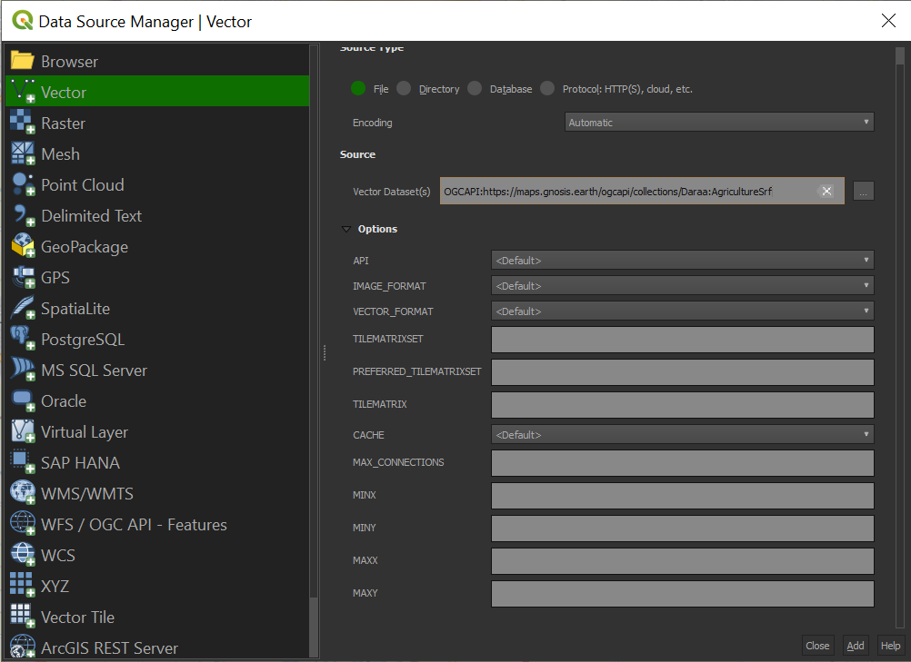

### QGIS

Although it does not directly integrate this functionality into its user interface, QGIS allows you to connect to OGC API Coverages endpoints through the GDAL drivers it uses.

#### Open an OGC API - Maps collection in QGIS

Follow the steps to add some collections from an OGC API - Maps enpoint: 

* From the Layer menu, select `Add Layer` > `Add Vector layer`

!!! tip

Alternatively, you can use the following key combination: `Ctrl + Shift + R`

*Connexion to an OGC API Maps service via QGIS*

* For the `Source Type` choose `File`

* In the Vector dataset(s) field, provide the `collection_id` endpoint (e.g `https://maps.gnosis.earth/ogcapi/collections/Daraa:AgricultureSrf`)preceded by the following string: `OGCAPI`

* Click on the `Add` button

The following datasource should then been displayed in your QGIS client.

*GNOSIS Daraa:AgricultureSrf*