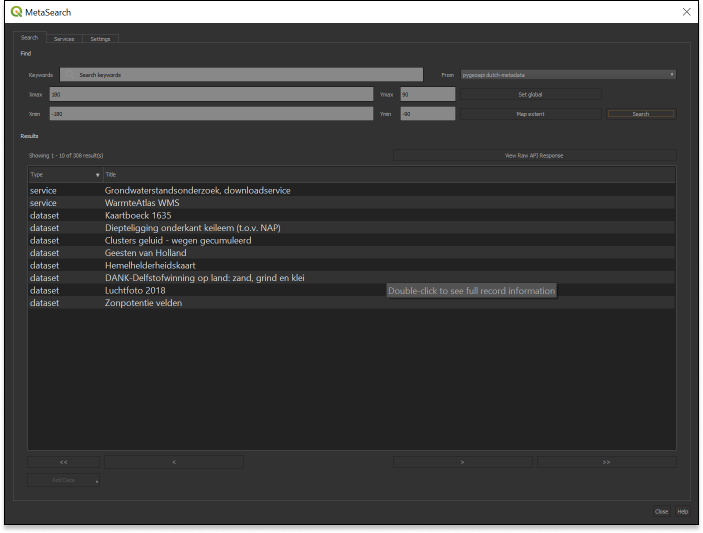
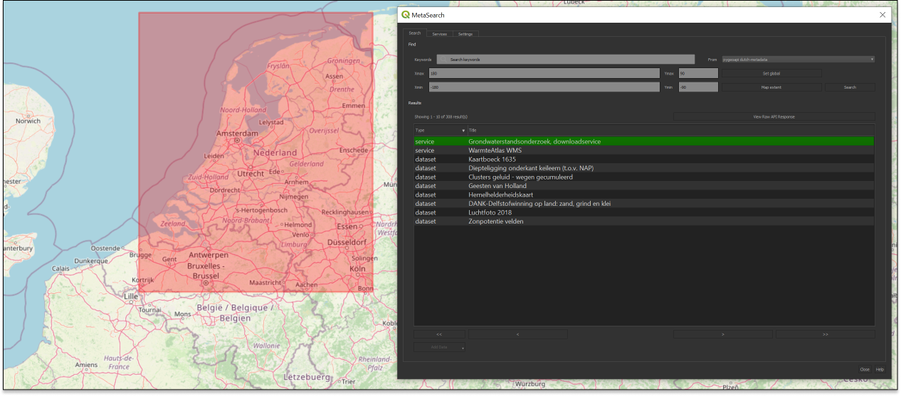

## Client access

### QGIS

QGIS supports OGC API - Records via the [MetaSearch plugin](https://docs.qgis.org/latest/en/docs/user_manual/plugins/core_plugins/plugins_metasearch.html). MetaSearch originally focused on Catalogue Service for the Web (OGC:CSW) only, but has been extended to OGC API - Records. MetaSearch is a default plugin in QGIS and requires no further installation.

!!! question "Query OGC API - Records from QGIS"

Follow these steps to connect to a service and query datasets:

- Locate the MetaSearch plugin in the Web menu or on the Toolbar . The main search panel will appear with the default MetaSearch catalogue list already populated.

- open the `Services` tab, to find the `New` button to create a new connection
- add a connection to `https://demo.pygeoapi.io/master`
- click `Service Info` to get information about the service
- return to the Search tab
- select the connection you have just created
- type a search term and click `search`
- notice that when you select a search result, a red footprint is drawn on the map highlighting the location of the dataset

