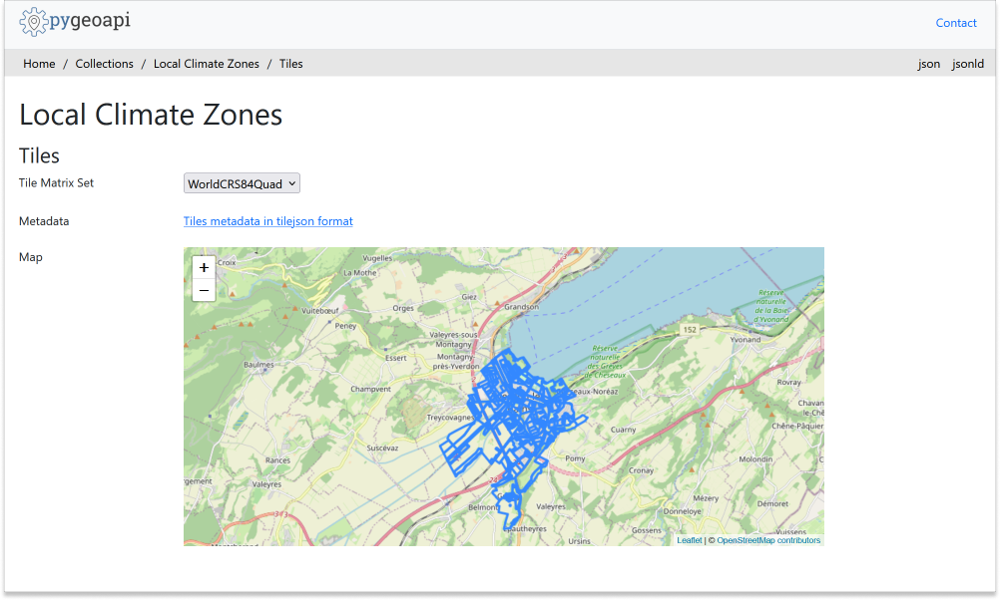
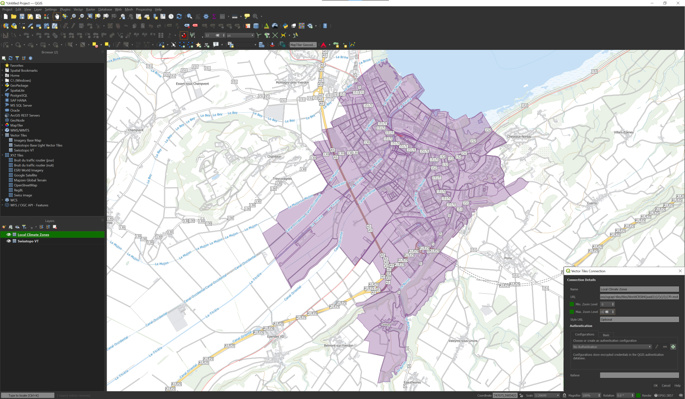
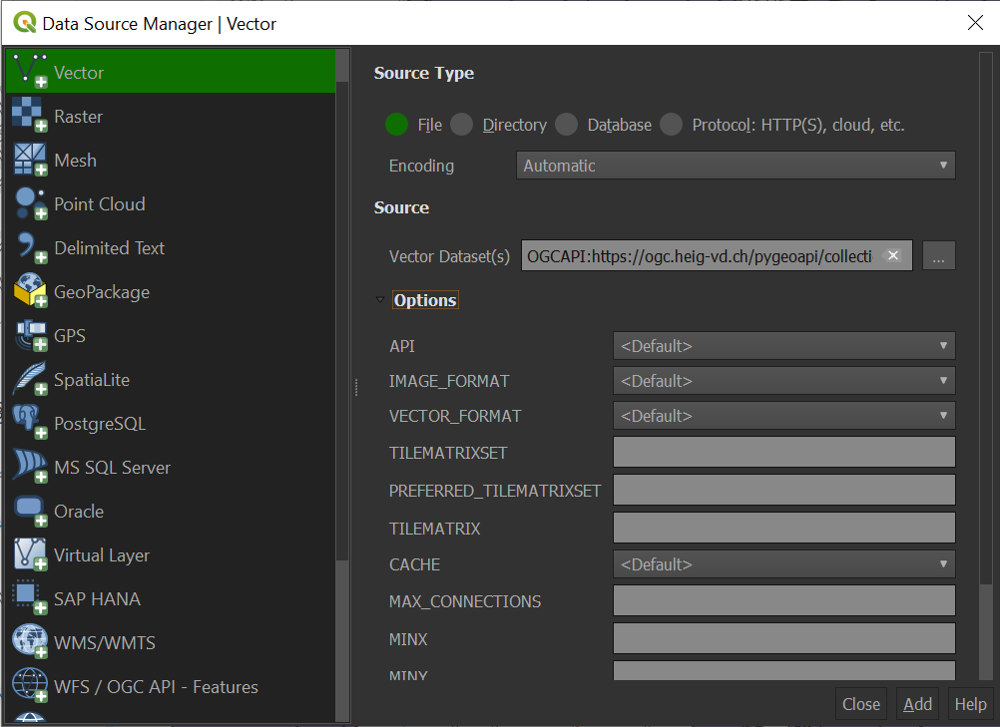

### QGIS

QGIS does not natively support the OGC API Tiles standard.

However, 2 options are possible:

- Use the mvt format when calling the API
- Use the underlying GDAL drivers to establish a connection to the API  

QGIS supports OGC API Vector Tiles via the [Vector Tiles Layer](https://docs.qgis.org/3.22/en/docs/user_manual/working_with_vector_tiles/vector_tiles_properties.html). Although OGC API - Tiles are not natively supported, you can customize the `generic connection` in order to access them in QGIS.

#### Access OGC API Tiles as mvt from QGIS

Before entering QGIS, access your pygeoapi installation page on the browser and follow these steps.

- access the collection page of the tiles dataset: `https://ogc.heig-vd.ch/pygeoapi/collections/ogcapi-tiles`
- navigate to the tiles page by clicking on `tiles`: `https://ogc.heig-vd.ch/pygeoapi/collections/ogcapi-tiles/tiles`
- click in `Tiles metadata in tilejson format`: `https://ogc.heig-vd.ch/pygeoapi/collections/ogcapi-tiles/tiles/WorldCRS84Quad/metadata`
- note the URL in `tiles`: `https://ogc.heig-vd.ch/pygeoapi/collections/ogcapi-tiles/tiles/WorldCRS84Quad/{tileMatrix}/{tileRow}/{tileCol}?f=mvt` and of the values of minZoom and maxZoom

{ width=100% }

Follow these steps to connect to a service and access vector tiles:

- locate the vector tiles service on the left hand side browser panel. Note that you can also use the top menu and navigate to `Layer > Add Layer > Vector Tile Layer`


- right-click to bring up the context menu and choose `New Generic connection`
- fill the required values. For URL, use the URL you noted from the previous step, replacing `{tileMatrix}/{tileRow}/{tileCol}` with `{z}/{x}/{y}`.
- press `OK` to add the service. At this point, if you are using the browser you should see the collection appearing in the menu, below "Vector Tiles"
- double-click in the collection to add it to the map
- zoom in to Yverdon-les-Bains to visualize your dataset

{ width=100% }


#### Access OGC API Tiles from QGIS through GDAL

Follow the steps to add some collections from an OGC API - Tiles enpoint: 

* From the Layer menu, select `Add Layer` > `Add Vector layer`

!!! tip

Alternatively, you can use the following key combination: `Ctrl + Shift + R`



* For the `Source Type` choose `File`

* In the Vector dataset(s) field, provide the `collection_id` endpoint (e.g `https://ogc.heig-vd.ch/pygeoapi/collections/ogcapi-tiles`)preceded by the following string: `OGCAPI`

* Click on the `Add` button

### LeafletJS

[LeafletJS](https://leafletjs.com) is a popular JavaScript library to add interactive maps to websites. LeafletJS does not support OGC API's explicitely, however can interact with OGC API by using the results of the API directly.

#### Add OGC API - Tiles to a website with LeafletJS

* copy the HTML below to a file called `vector-tiles.html`
* open the file in a web browser

The code uses the LeafletJS library with the [leaflet.vectorgrid](https://github.com/Leaflet/Leaflet.VectorGrid) plugin to display the lakes OGC API - Tiles service on top of an OpenStreetMap base layer.

``` {.html linenums="1"}
<html>
<head><title>OGC API - Tiles Leaflet integration</title></head>
<body>
<div id="map" style="width:100vw;height:100vh;"></div>
<link rel="stylesheet" href="https://unpkg.com/leaflet@1.0.3/dist/leaflet.css"/>
<script type="text/javascript" src="https://unpkg.com/leaflet@1.3.1/dist/leaflet.js"></script>
<script type="text/javascript" src="https://unpkg.com/leaflet.vectorgrid@1.2.0"></script>
<script>
map = L.map('map').setView({ lat:46.76701384881549  , lng:6.638197794254149 }, 12);
map.addLayer(
    new L.tileLayer('https://stamen-tiles-{s}.a.ssl.fastly.net/watercolor/{z}/{x}/{y}.{ext}', {
    attribution: 'Map tiles by <a href="https://stamen.com">Stamen Design</a>, <a href="https://creativecommons.org/licenses/by/3.0">CC BY 3.0</a> &mdash; Map data &copy; <a href="https://www.openstreetmap.org/copyright">OpenStreetMap</a> contributors',
    subdomains: 'abcd',
    minZoom: 1,
    maxZoom: 16,
    ext: 'jpg'
    }));
map.addLayer(new L.vectorGrid.protobuf(
    'https://ogc.heig-vd.ch/pygeoapi/collections/ogcapi-tiles/tiles/WorldCRS84Quad/{z}/{x}/{y}?f=mvt', 
    { rendererFactory: L.canvas.tile }));
</script>
</body>
</html>
```

   { width=100% }

## OpenLayers

[OpenLayers](https://openlayers.org) is a popular JavaScript library to add interactive maps to websites. OpenLayers natively supports OGC API - Tiles.

!!! tip 

    See the [official OpenLayers documentation](https://openlayers.org/en/latest/examples/ogc-vector-tiles.html)