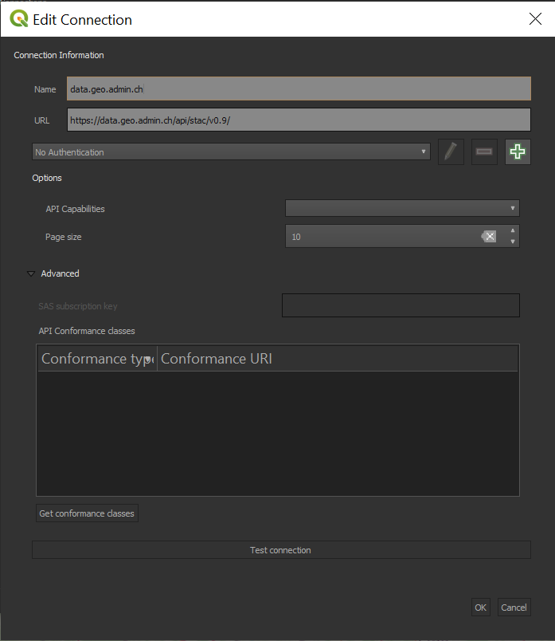
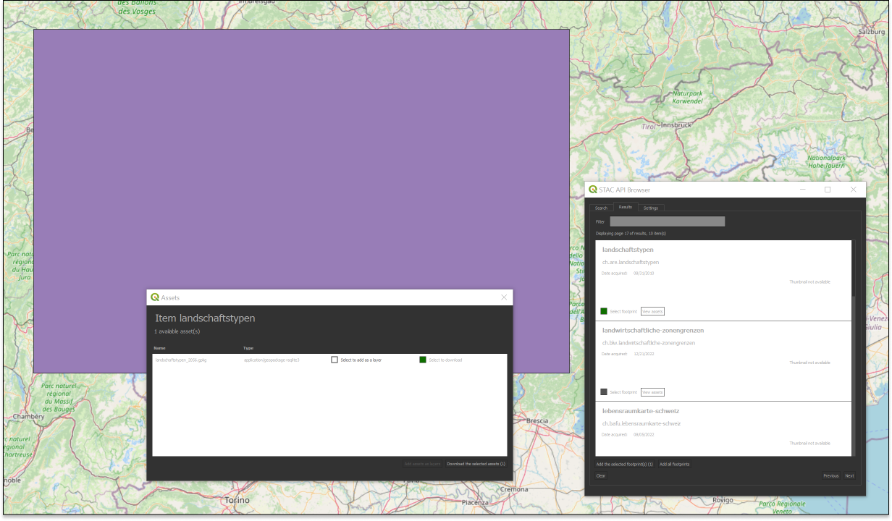
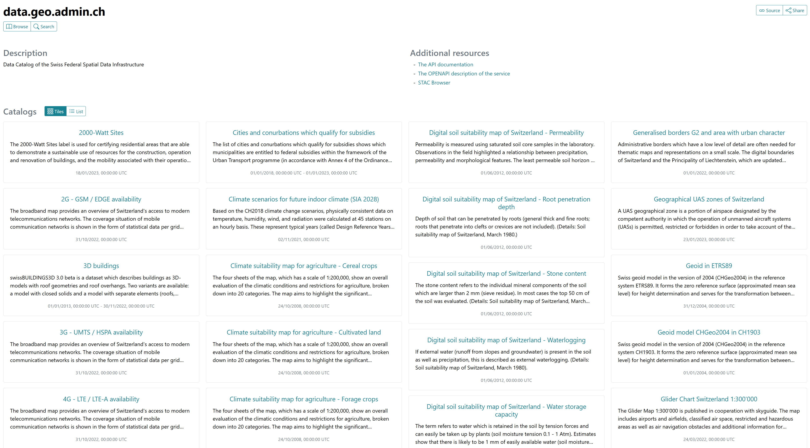

## Client access

### QGIS

QGIS supports STAC via the [STAC API Browser](https://plugins.qgis.org/plugins/qgis_stac/) plugin which can be installed via the plugin manager (`Plugins` > `Manage and and Install Plugins`).

!!! question "Query STAC collections from QGIS"

Follow these steps to connect to a service and query datasets:

- Create a new connection by clicking on `New` under `Connections`
- Enter the target url (e.g. `https://data.geo.admin.ch/api/stac/v0.9/`)

- open the `Search` tab, to find the `New` button to create a new connection
- add a connection to `https://data.geo.admin.ch/api/stac/v0.9/`
- click on the `Search` button to get information about the STAC collections
- notice that when you select a search result, a footprint is drawn on the map highlighting the location of the dataset
- you can then download the item

### STAC Browser

!!! question "Query STAC collections from the STAC browser"

- head to https://radiantearth.github.io/stac-browser/#/
- specify the following url: `https://data.geo.admin.ch/api/stac/v0.9/` under `Please specify a STAC Catalog or API...`
- click on the `Load` button.
- select the desired collection

